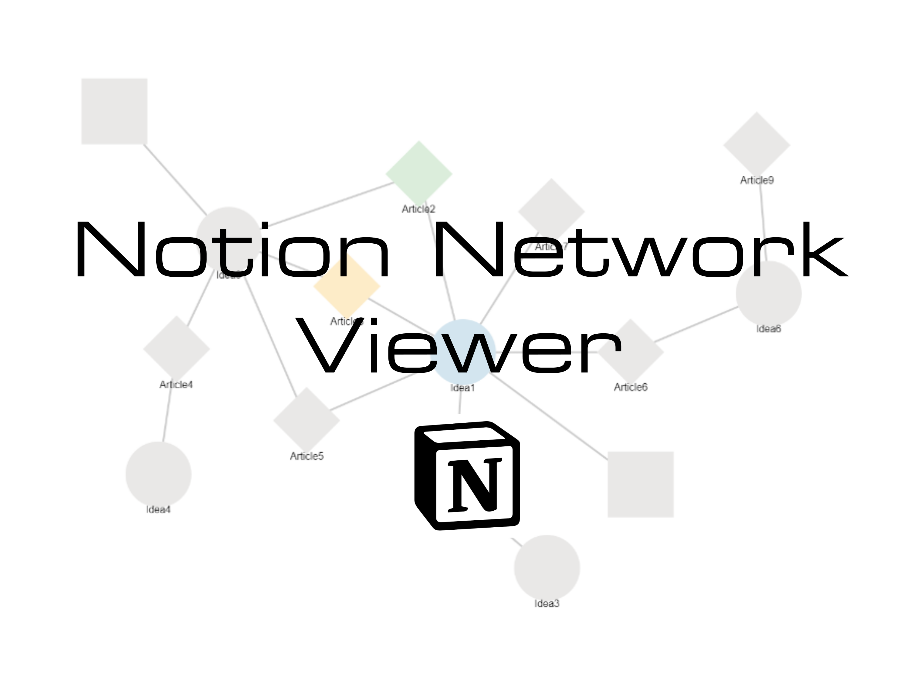
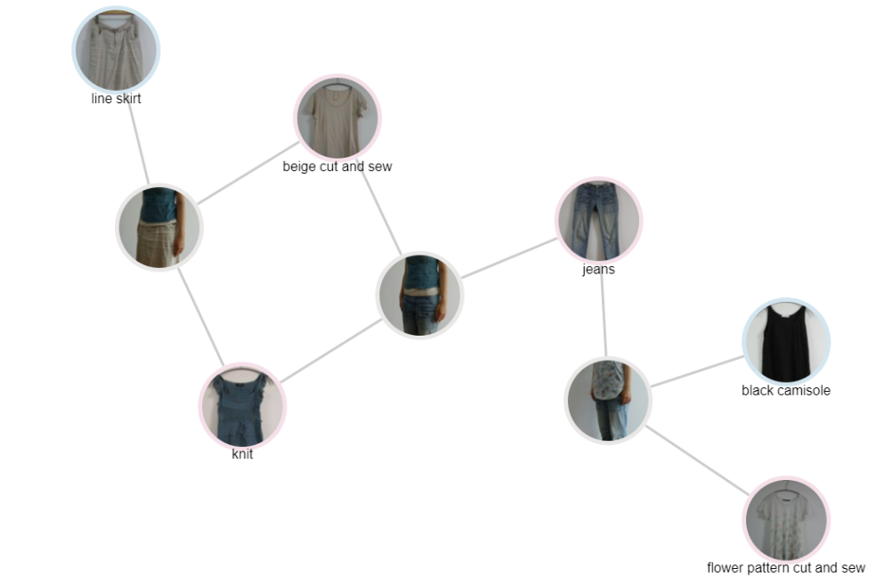

<div align="center">
  <h1>
    Notion Network Viewer
  </h1>
  <div>
    
    
    
    
  </div>

  
  <p>
    <a href="https://nnv.satocheeen.com/">
        Web Site
    </a>
  </p>
</div>

## Overview
リレーション項目で繋がった複数のNotionデータベースの関連を可視化するシステムです。



### Main Features

- リレーション項目を持つNotionデータベースを図示
- ページ間のリレーション作成
- 新規ページ作成
- フィルタ機能


## Quick setup
```
npm i
npm run dev
```
## Environments
### NotionAPI関連
本システムでは、NotionAPIを利用しています。 
NotionAPIを使用するためのIntegrationを発行して、環境変数に設定してください。

参考) NotionAPI 公式ドキュメント  
https://developers.notion.com/docs/getting-started

Internal Integration、Public Integration の両方に対応しています。

#### Internal Integration を用いる場合
| 環境変数 | 必須 | 設定値 |
|--|--|--|
| NOTION_INTERNAL_KEY | 必須 | NotionAPIのインテグレーションキー  |

#### Public Integrationを用いる場合
| 環境変数 | 必須 | 設定値 |
|--|--|--|
| NEXT_PUBLIC_NOTION_API_CLIENT_ID | 必須 | NotionAPI用のClientID |
| NOTION_SECRET_KEY | 必須 | NotionAPI用のシークレットキー |
| NEXT_PUBLIC_NOTION_OAUTH_REDIRECT_URL | 任意 | NotionのOAuth認証時のリダイレクト先。未指定時は`${protocol}://${host}/callback`が設定される。開発環境でのOAuth挙動確認時に利用するために用意。

## Version History
### v1.1.0-alpha (2025/01/28)
- Next.jsで再構築
- 状態管理をReduxからJotaiに変更

### v1.0.3 (2022/06/09) ⇒ 現在の本番環境Ver.
- URLプロパティについて、コンテキストメニューからURLに遷移できるように対応

### v1.0.0 (2022/03/21)
- システム一般公開
- React + Express + Docker の構成